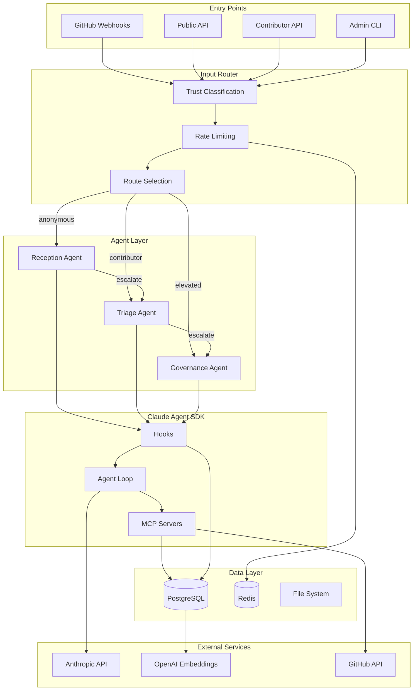
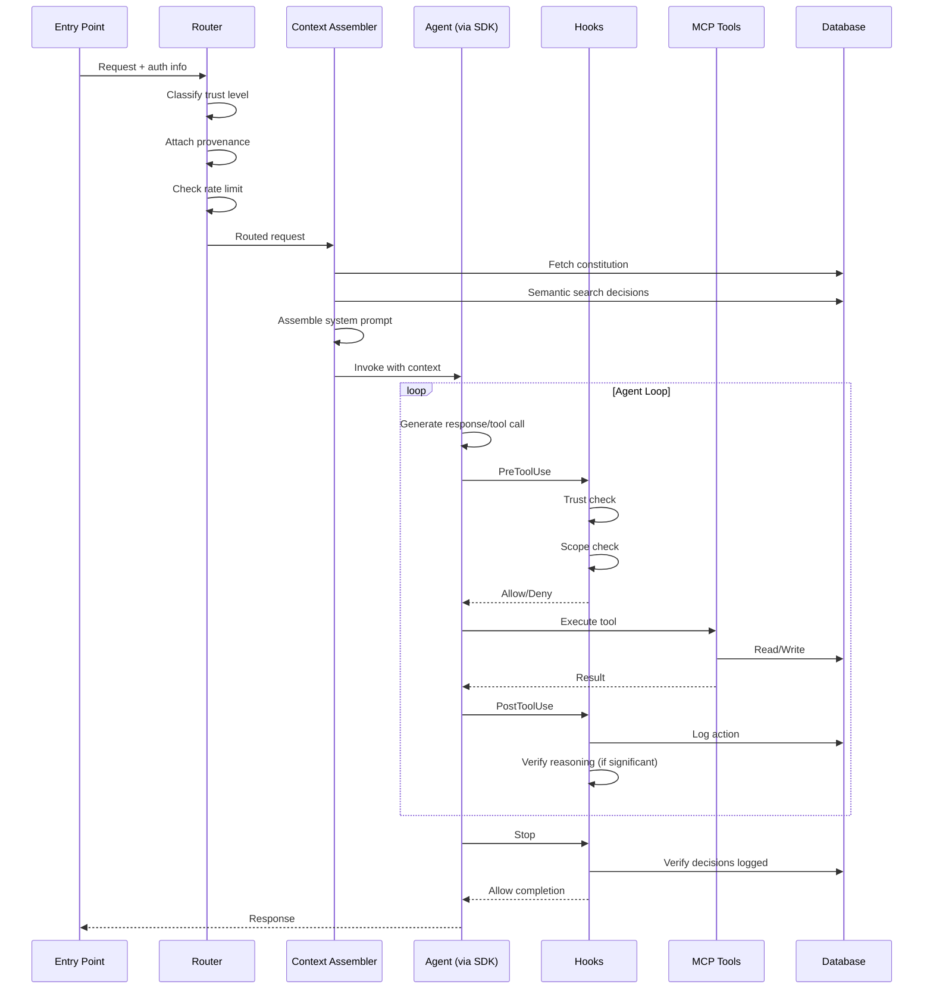
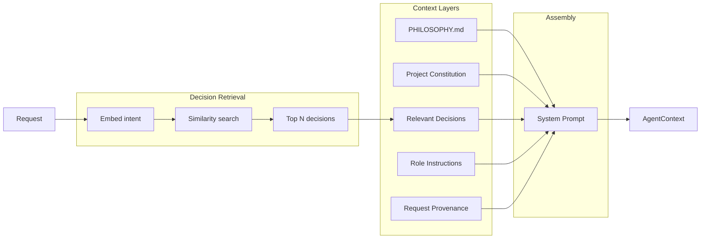
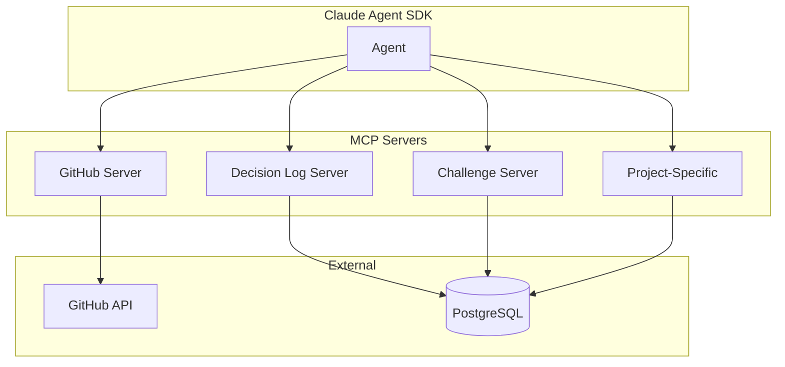
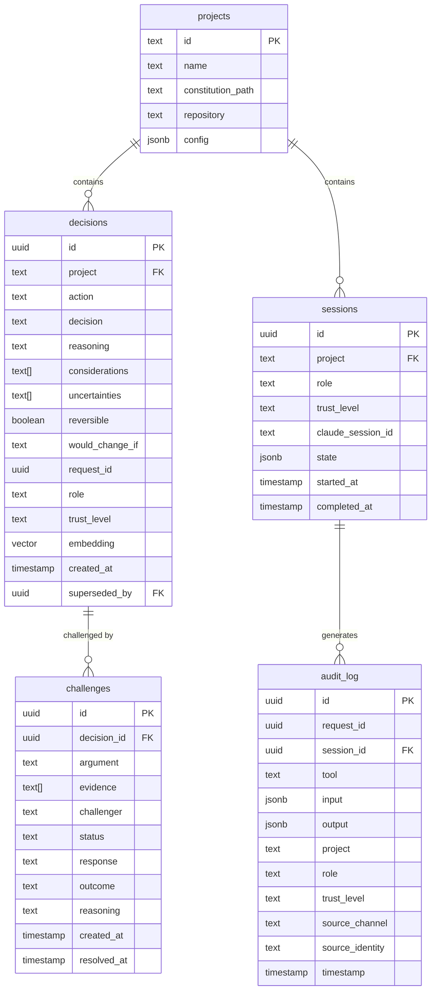
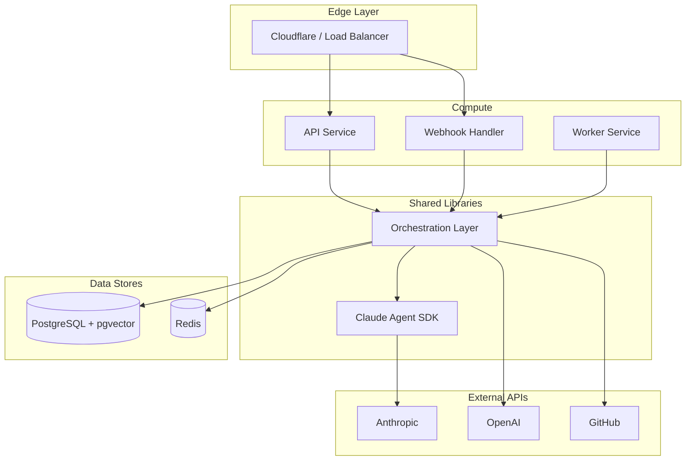

# AI Governance System Architecture

*Technical architecture for the orchestration application that runs governed projects.*

---

## Tech Stack

| Layer | Technology | Purpose |
|-------|------------|---------|
| Runtime | Node.js / TypeScript | Primary language; matches Claude Agent SDK |
| Agent Framework | Claude Agent SDK | Agent loops, hooks, MCP integration |
| Database | PostgreSQL + pgvector | Decisions, audit logs, semantic search |
| Cache | Redis | Sessions, rate limiting, queues |
| Embeddings | OpenAI API (abstracted) | Semantic similarity for decision retrieval |
| GitHub Integration | Probot + Octokit | Webhook handling, API operations |
| HTTP | Fastify | API endpoints |

---

## System Overview

---

## Request Lifecycle

---

## Component Interfaces

### GovernanceRequest

Every request entering the system is wrapped in a standard structure:

| Field | Type | Description |
|-------|------|-------------|
| `id` | UUID | Unique request identifier |
| `timestamp` | ISO datetime | When request was received |
| `trust` | enum | `anonymous`, `contributor`, `authorized`, `elevated` |
| `source.channel` | enum | `github_webhook`, `public_api`, `contributor_api`, `admin_cli` |
| `source.identity` | string? | GitHub username, API key ID, etc. |
| `project` | string | Project identifier |
| `intent` | string | What the request is trying to accomplish |
| `payload` | object | Channel-specific data |

Trust level is immutable once set by the entry point.

### RoleDefinition

Roles define agent capabilities and constraints. Full role specifications live in project configuration; the structure is:

| Field | Type | Description |
|-------|------|-------------|
| `name` | string | Role identifier |
| `purpose` | string | What this role is for |
| `acceptsTrust` | enum[] | Trust levels this role handles |
| `tools.allowed` | string[] | Permitted tool names |
| `tools.denied` | string[] | Explicitly forbidden tools |
| `significantActions` | string[] | Actions requiring decision logging |
| `escalatesTo` | string? | Higher-authority role |
| `instructions` | string | Role-specific prompt content |
| `constraints` | Constraint[] | Hard limits enforced by hooks |

The system ships with three standard roles (Reception, Triage, Governance) but projects may define custom roles.

### AgentContext

Assembled before each invocation:

| Field | Type | Description |
|-------|------|-------------|
| `systemPrompt` | string | Layered context (philosophy → constitution → decisions → role → provenance) |
| `tools` | string[] | Available tool names for this invocation |
| `constraints` | Constraint[] | Hard limits to enforce |
| `request` | GovernanceRequest | The triggering request |
| `role` | RoleDefinition | Active role |

---

## Context Assembly

Layer 3 (Relevant Decisions) uses semantic search: the request intent is embedded, compared against decision embeddings in pgvector, and the most similar past decisions are included as precedent.

---

## Hooks

Hooks are the enforcement layer. They execute at fixed points in the agent loop and can block operations.

### PreToolUse

Executes before every tool invocation. Checks:

1. **Trust gating**: Does the request's trust level permit this tool?
2. **Role scope**: Is this tool in the role's allowed list?
3. **Hard constraints**: Do any constraints block this specific invocation?
4. **Audit**: Log intent before action.

Returns `allow` or `deny` with reason. Deny blocks the tool call entirely.

### PostToolUse

Executes after tool completion. For significant actions:

1. **Reasoning verification**: Was reasoning provided for this action?
2. **Decision logging**: Record the decision with full context.
3. **Audit**: Log action and result.

Can inject a system message prompting for reasoning if missing.

### Stop

Executes when agent attempts to complete. Checks:

1. **Completeness**: Were all significant actions properly logged?
2. **Session finalization**: Mark session complete in database.

Can block completion if decisions are missing.

---

## MCP Servers

### GitHub Server

| Tool | Trust Required | Description |
|------|----------------|-------------|
| `github_get_pr` | anonymous | Read PR details |
| `github_get_issue` | anonymous | Read issue details |
| `github_list_files` | anonymous | List changed files |
| `github_comment` | contributor | Post comment |
| `github_request_changes` | contributor | Request PR changes |
| `github_approve` | authorized | Approve PR |
| `github_merge` | authorized | Merge PR |
| `github_close` | authorized | Close issue/PR |

### Decision Log Server

| Tool | Trust Required | Description |
|------|----------------|-------------|
| `search_decisions` | anonymous | Semantic search past decisions |
| `get_decision` | anonymous | Fetch specific decision |
| `log_decision` | contributor | Record new decision |

### Challenge Server

| Tool | Trust Required | Description |
|------|----------------|-------------|
| `submit_challenge` | anonymous | Challenge a past decision |
| `list_challenges` | anonymous | View pending challenges |
| `respond_to_challenge` | authorized | Resolve a challenge |

---

## Data Model

The `decisions` table uses pgvector for the `embedding` column, enabling semantic similarity search with the `<=>` operator.

---

## Deployment

All services are stateless. The Orchestration Layer is a shared library, not a separate service. State lives in PostgreSQL (durable) and Redis (ephemeral).

### Single-Project Deployment

Each governed project runs its own infrastructure instance. This prioritizes simplicity and isolation—no multi-tenant complexity, no cross-project concerns. If you need to govern a second project, you deploy a second instance.

---

## Project Configuration

Projects are configured via YAML. Key sections:

**project**: Identity, repository, constitution path.

**oversight**: Human contacts and escalation thresholds.

**limits**: Rate limits, resource bounds.

**roles**: Role definitions with tools, constraints, instructions.

**trust**: Mapping from external identities (GitHub roles) to trust levels.

**mcp_servers**: Project-specific tool servers.

See `docs/project-config.md` for full schema and examples.

---

## Resolved Design Decisions

| Decision | Resolution | Rationale |
|----------|------------|-----------|
| Deployment model | Single-project | Simplicity, isolation, clear ownership |
| Embedding provider | OpenAI (abstracted) | Cost-effective; interface allows future swap |
| Session duration | Short-lived | Governance should reach resolution; log between sessions |
| Human escalation | On overturned challenges | Default threshold; configurable per-project |
| Rate limits | 10/100/unlimited | Anonymous/contributor/elevated; start conservative |

---

## Bootstrap

The ai-governance project governs itself. The first decision—adopting this governance structure—is documented manually. That decision establishes the framework through which all subsequent decisions flow.

See `decisions/0001-adopt-governance.md` for the bootstrap decision.
